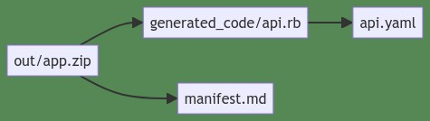

# Suburb


### The developer friendly build graph

If you want fast and predictable builds, you need a proper build graph. 

One that knows inputs and outputs to proper cache builds. 

You don't need a complicated build tool that locks you in and symlinks your files all over the place. 

You need a build tool that simply connects your build tools with a graph.

You need

Suburb 

### A taste of Suburb

Build definitions live in files called `subu.rb`. In this one, two output files are declared. 
They are connected through the `using:` argument.


`subu.rb`: (&larr; the build definition file)

```ruby

build 'out/A.txt' do
  run 'touch out/A.txt'
end

build 'out/B.txt', using: 'out/A.txt' do
  run 'touch out/B.txt'
end

```

Here, the file named `out/B.txt` can only be build after `out/A.txt` is built. So Suburb builds A.txt then proceeds to B.txt.
This is the simplest build graph imaginable. But Suburb can do a whole lot more than that.

A.txt and B.txt will be built right in your file system, where you expect them to be. No confusing symlinks or vritualization going on. Which means your source maps and debug symbols will point to your source code, as you would expect.


### Suburb caches results. No need to build if dependencies are unchanged.

With suburb, all tasks are file tasks. A file must be produced (Make-style phony tasks do not exist). Caching is 
simply based on file modification date.

`subu.rb`

```ruby

build 'test-results.txt', using: ['src/**/*.ts', 'test/**/*.ts', 'node_modules', 'pnpm-lock.yaml'] do 
  output = 'vitest'
  save output, 'test-results.txt'
end

build 'dist/index.html', using: ['src/**/*.ts', 'node_modules', 'pnpm-lock.yaml'] do
  run 'vite build'
end

build ['node_modules', 'pnpm-lock.yaml'], using: ['package.json'] do
  run 'pnpm install'
end

```

Now, at the root, you can say:

```bash

suburb dist/index.html

# ┌ Building dist/index.html ▣▣
# └── node_modules
# ℹ info    Completed in 7 ms.
# ℹ info    Log file: cat ./suburb.log

```

You can ask Suburb to visualize the dependency tree by using the `-t` or `--show-tree` flag. 
And if you are in the iTerm2 terminal or one that supports displaying images inline, you can see the dependency graph directly in the terminal.

```bash
suburb app.zip -t
```



### Dynamic Discovery

Imagine you have on main project and two sub projects. Your main project is a web app. One sub project is a WASM library built using C++. The other is an npm package built using pnpm and Vite.

Dynamic discovery means you can have the build definitions right next to each individual project root. Dependencies in one subu.rb file can reference targets in other subu.rb files elsewhere in the project structure. 


## Requirements

Ruby 3.1.3 or higher.

Supports Macos, Linux and Windows.

## Installation

```bash
gem install suburb
```

## Usage

```
Usage: suburb [OPTIONS] [FILES...]

The developer friendly build graph

Arguments:
  FILES  The relative path(s) of the file(s) you want to build.

Options:
  -c, --clean      Delete file and all its (transitive) dependencies.
  -f, --force      Force rebuilding file and all dependencies.
  -h, --help       Print usage
  -l, --list       List the files that can be build in this directory, its
                   parent or child directories.
  -t, --show-tree  Show a visual graph of the dependency tree.
  -v, --verbose    Print detailed log to stdout

Examples:
  Build npm package
    $ suburb pkg/mything.tgz

  List buildable targets
    $ suburb -l

  Run tests, even if no dependencies changed
    $ suburb -f test-results.txt

  Show dependency graph
    $ suburb -t dist/index.html

  Clean (remove) file all dependencies
    $ suburb --clean
```

## Philosophy behind Suburb

Makefiles and Rakefiles are easy to read and understand. 
They have two flaws though: 1) They require the entire graph to be specified in one (M/R)akefile. While you can invoke one from another, there is no tree/graph of targets and their dependencies.

Bazel has good tool isolation, great build dependency isolation, predictable builds and caching.

Docker buildx and bake has easy to understand Dockerfiles and great tool isolation during build. But it has a mediocre concept of complete build graphs (additional_contexts). It does have caching, based on checksums but made with the concept of layers instead of a true tree. 

Vite, rollup, ESBuild and that lot are great at Typescript and Javascript projects, but that's all they do. Time to build Rust or C++ and you have to look elsewhere anyway.

Imagine you could find a build graph that worked with your existing tool chains?


## What Suburb does differently

**Acyclic Build Graph**
Provides an way of **connecting different build systems** into one, coherent graph.
A build definition allows declaring output files, input files and recipe to build a target. 

**Files, files, files**
All targets are files. No phony targets (Make), not task targets (Rake), no _test_ or _run_ targets (Bazel).

**Caches results.** 
For now, caches by file modification time. In the future, by file fingerprint/hash.
Uses your project folders instead of relocating building to some exoctic temp dir. This also makes source maps and debug symbols point to your actual source locations. How nice is that? 

**Only does one thing well.** 
Relies on toolchain managers for what they are good at. Integrates by default with [RTX]() but you can choose another tools manager or install prerequisites and tools manually. 
Relies on package managers for what they are good at. If a subproject is full of Rust code, use Cargo. If it's a web app, use Vite.

**Non invasive.** 
You can still work on your local machine like you are used to. Run `pnpm run dev` or `rails s` or `cmake ..` without limitations.


## Why the name?

**Su**per **Bu**ild 

Build definition files are named subu.rb. I wanted build definitions to end with .rb so editors can highlight and understand the ruby code.

